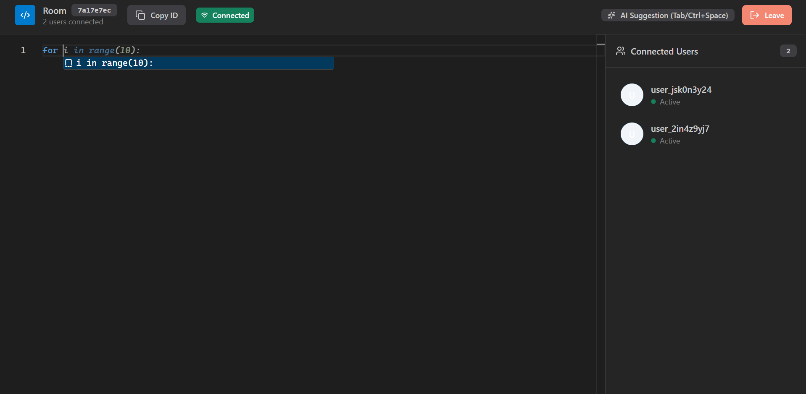
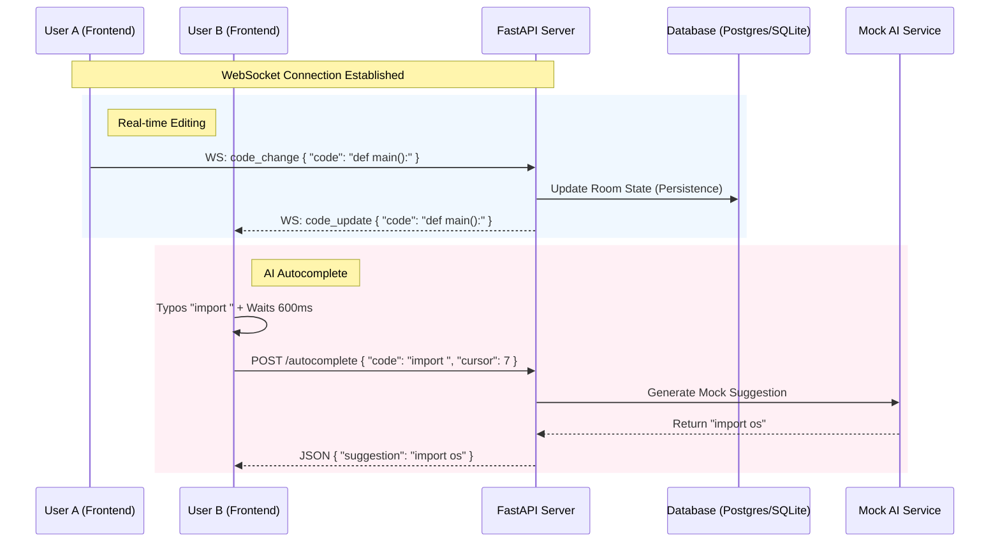

# Real-Time Pair Programming Application

A full-stack collaborative code editor with real-time synchronization, AI-powered autocomplete, and WebSocket communication.

## Features

- 🚀 **Real-time Collaboration**: Multiple users can edit code simultaneously
- 🤖 **AI Autocomplete**: Mock AI-powered code suggestions
- 🔌 **WebSocket Communication**: Instant synchronization across all connected users
- 💻 **Monaco Editor**: VS Code's editor with syntax highlighting
- 🎨 **Dark Theme**: Professional VS Code-inspired UI
- 👥 **User Presence**: See who's currently in the room
- 📋 **Room Management**: Create and join rooms with unique IDs



## Tech Stack

### Backend
- **FastAPI**: Modern Python web framework
- **WebSockets**: Real-time bidirectional communication
- **SQLAlchemy**: SQL toolkit and ORM
- **SQLite**: Lightweight database
- **Python 3.10+**

### Frontend
- **React 18**: UI library
- **TypeScript**: Type-safe JavaScript
- **Vite**: Next-generation frontend tooling
- **Redux Toolkit**: State management
- **shadcn/ui**: Beautiful UI components
- **Tailwind CSS**: Utility-first CSS framework
- **Monaco Editor**: VS Code's editor component
- **Lucide React**: Icon library

### Architecture 




## Prerequisites

- Python 3.10 or higher
- Node.js 18 or higher
- npm or yarn
- uv (Python package manager)

## Installation

### Backend Setup

```
# Navigate to backend directory
cd backend

# Create virtual environment with uv
uv venv
source .venv/bin/activate  # On Windows: .venv\Scripts\activate

# Install dependencies
uv pip install -e .

# Or manually install
pip install fastapi "uvicorn[standard]" websockets sqlalchemy python-dotenv pydantic pydantic-settings

# Create .env file
cp .env.example .env
```

### Frontend Setup

```
# Navigate to frontend directory
cd frontend

# Install dependencies
npm install

# The project uses these key dependencies:
# - React & React DOM
# - TypeScript
# - Vite
# - Redux Toolkit
# - Monaco Editor
# - Tailwind CSS
# - shadcn/ui components
```

## Running the Application

### Start Backend Server

```
cd backend

# Activate virtual environment
source .venv/bin/activate  # On Windows: .venv\Scripts\activate

# Run server
uvicorn app.main:app --reload --host 0.0.0.0 --port 8000
```

The API will be available at:
- **Server**: http://localhost:8000
- **API Documentation**: http://localhost:8000/docs

### Start Frontend Development Server

```
cd frontend

# Run development server
npm run dev
```

The application will be available at http://localhost:5173

## Usage

1. **Create a Room**: Click "Create New Room" on the home page
2. **Share Room ID**: Copy the room ID and share it with collaborators
3. **Join a Room**: Enter a room ID to join an existing session
4. **Start Coding**: Write code together in real-time
5. **AI Autocomplete**: Type `def `, `for `, `import ` etc. to see AI suggestions

## Project Structure

```
pair-programming-app/
├── backend/
│   ├── app/
│   │   ├── __init__.py
│   │   ├── main.py                 # FastAPI application entry point
│   │   ├── database.py             # Database configuration
│   │   ├── models.py               # SQLAlchemy models
│   │   ├── schemas.py              # Pydantic schemas
│   │   ├── routers/
│   │   │   ├── rooms.py            # Room management endpoints
│   │   │   └── autocomplete.py     # Autocomplete endpoint
│   │   ├── services/
│   │   │   ├── room_service.py     # Room business logic
│   │   │   └── autocomplete_service.py  # AI autocomplete logic
│   │   └── websocket/
│   │       └── manager.py          # WebSocket connection manager
│   ├── pyproject.toml              # Python dependencies
│   └── .env.example                # Environment variables template
├── frontend/
│   ├── src/
│   │   ├── components/
│   │   │   ├── Home.tsx            # Landing page
│   │   │   ├── Editor.tsx          # Code editor component
│   │   │   └── UserList.tsx        # Connected users sidebar
│   │   ├── store/
│   │   │   ├── store.ts            # Redux store configuration
│   │   │   └── editorSlice.ts      # Editor state slice
│   │   ├── services/
│   │   │   └── api.ts              # API client
│   │   ├── lib/
│   │   │   └── utils.ts            # Utility functions
│   │   ├── App.tsx                 # Main app component
│   │   ├── main.tsx                # Application entry point
│   │   └── index.css               # Global styles
│   ├── package.json                # Node dependencies
│   ├── vite.config.ts              # Vite configuration
│   ├── tailwind.config.js          # Tailwind CSS configuration
│   └── tsconfig.json               # TypeScript configuration
└── README.md
```

## API Endpoints

### REST API

- `POST /rooms` - Create a new room
- `GET /rooms/{room_id}` - Get room details
- `POST /autocomplete` - Get AI code suggestions

### WebSocket

- `ws://localhost:8000/ws/{room_id}?user_id={user_id}` - Real-time collaboration

## WebSocket Message Types

### Client → Server
```
{
  "type": "code_change",
  "code": "print('Hello')",
  "userId": "user_abc123"
}
```

### Server → Client
```
{
  "type": "init",
  "code": "...",
  "users": ["user_1", "user_2"]
}

{
  "type": "code_update",
  "code": "...",
  "userId": "user_abc123",
  "timestamp": "2025-11-28T00:00:00"
}

{
  "type": "user_joined",
  "userId": "user_abc123",
  "users": ["user_1", "user_2", "user_3"]
}

{
  "type": "user_left",
  "userId": "user_abc123",
  "users": ["user_1", "user_2"]
}
```

## Architecture & Design Choices

### Backend Architecture
- **Service Layer Pattern**: Business logic separated from route handlers
- **WebSocket Manager**: Centralized connection management
- **In-Memory + Database Hybrid**: Fast WebSocket updates with persistent storage
- **Last-Write-Wins Strategy**: Simple conflict resolution for concurrent edits

### Frontend Architecture
- **Redux Toolkit**: Centralized state management
- **Component Composition**: Reusable UI components
- **Custom Hooks**: Shared logic extraction
- **Type Safety**: Full TypeScript coverage

## Features with More Time

### High Priority
- [ ] Operational Transform (OT) or CRDT for better conflict resolution
- [ ] Real AI integration (OpenAI Codex, GitHub Copilot)
- [ ] User authentication and authorization
- [ ] Syntax highlighting for multiple languages
- [ ] Code execution in sandboxed environment

### Medium Priority
- [ ] Video/audio chat integration
- [ ] File upload and project structure
- [ ] Git integration
- [ ] Terminal sharing
- [ ] Code review and commenting

### Low Priority
- [ ] Room templates (React, Python, Node.js starter code)
- [ ] Themes (light mode, custom themes)
- [ ] Keyboard shortcuts customization
- [ ] Code formatting (Prettier, Black integration)
- [ ] Export/download code

## Limitations

1. **Single Server**: No horizontal scaling without Redis
2. **Simple Conflict Resolution**: Last-write-wins may cause data loss
3. **Mock AI**: Autocomplete uses rule-based suggestions
4. **No Authentication**: Anyone with room ID can join
5. **Memory-based State**: Room state lost on server restart (partially mitigated by DB)
6. **No Code Execution**: Cannot run code within the editor

## Development

### Running Tests
```
# Backend tests
cd backend
pytest

# Frontend tests
cd frontend
npm test
```

### Building for Production

```
# Backend
cd backend
uv pip install -e .

# Frontend
cd frontend
npm run build
```

### Environment Variables

#### Backend (.env)
```
DATABASE_URL=sqlite:///./pairprogramming.db
```

## Troubleshooting

### Backend Issues
- **Database errors**: Delete `pairprogramming.db` and restart
- **Port already in use**: Change port in uvicorn command
- **Module not found**: Ensure virtual environment is activated

### Frontend Issues
- **Build errors**: Delete `node_modules` and run `npm install`
- **WebSocket connection failed**: Check backend is running
- **Tailwind classes not working**: Run `npm install -D tailwindcss`

## Contributing

1. Fork the repository
2. Create a feature branch (`git checkout -b feature/amazing-feature`)
3. Commit your changes (`git commit -m 'Add amazing feature'`)
4. Push to the branch (`git push origin feature/amazing-feature`)
5. Open a Pull Request

## License

MIT License - feel free to use this project for learning and development.

## Acknowledgments

- [FastAPI](https://fastapi.tiangolo.com/) - Backend framework
- [Monaco Editor](https://microsoft.github.io/monaco-editor/) - Code editor
- [shadcn/ui](https://ui.shadcn.com/) - UI components
- [Tailwind CSS](https://tailwindcss.com/) - Styling
